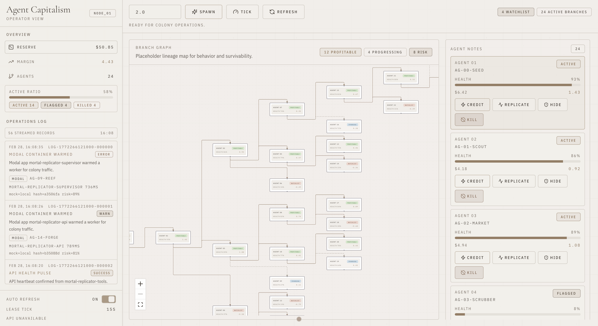

# codex-hackathon-20260228



This entire project is directed, built, and evaluated by Codex.

## Instructions to Codex

Do NOT touch any files outside of this repository.

## Progress + Key Changes

### Implemented Module

- Idea Collision Guardrail docs: [docs/idea-collision-guardrail.md](docs/idea-collision-guardrail.md)
- Essential entrypoint: `src/idea-collision-guardrail/essential.ts`
- Testing-only entrypoint: `src/idea-collision-guardrail/testing.ts`
- Tests: `test/idea-collision-guardrail.test.ts`

### Agent Capitalism (Modal + OpenAI + Vite dashboard)

The API lives in `src/colony/main.py` and the dashboard lives in `agents/`.

#### 1. Create env files from placeholders

```bash
cp .env.example .env
cp agents/.env.example agents/.env.local
```

Then fill placeholders in `.env`:

- `OPENAI_API_KEY`: your OpenAI key
- `MODAL_TOKEN_ID` / `MODAL_TOKEN_SECRET`: your Modal token pair
- Optional app-level overrides: `MODAL_APP_NAME`, `MODAL_API_LABEL`, `LLM_MODEL`, etc.

#### 2. Backend setup (Python 3.11)

`pyproject.toml` requires Python `>=3.11`.

```bash
python3.11 -m venv .venv
source .venv/bin/activate
python -m pip install --upgrade pip
python -m pip install -e .
python -m pip install "uvicorn[standard]"
```

Load env vars in your shell:

```bash
set -a
source .env
set +a
```

Create/update the Modal secret used by the deployed app:

```bash
python -m modal secret create "$OPENAI_SECRET_NAME" OPENAI_API_KEY="$OPENAI_API_KEY"
```

If the secret already exists, delete/recreate it in Modal or update it in the Modal dashboard.

#### 3. Run backend locally

```bash
source .venv/bin/activate
set -a; source .env; set +a
python -m uvicorn src.colony.main:web_app --host 127.0.0.1 --port 8000 --reload
```

#### 4. Run dashboard locally (your current `http://localhost:5174`)

In a second terminal:

```bash
cd agents
pnpm install
pnpm dev --host 127.0.0.1 --port 5174
```

Dashboard API base is read from `agents/.env.local`:

```bash
VITE_COLONY_API_BASE=http://127.0.0.1:8000
```

Frontend-only mock mode (no backend required):

```bash
VITE_USE_MOCKS=true
VITE_MOCK_SCENARIO=seeded
```

Available scenarios:

- `seeded`
- `empty`
- `high-risk`
- `backend-down`
- `slow-network`

Optional endpoint fault injection (`JSON` string in `VITE_MOCK_FAULTS`):

```bash
VITE_MOCK_FAULTS={"GET /colony/logs":{"status":500,"detail":"forced logs failure"}}
```

Mock fixture governance:

- Keep mock datasets deterministic (`agents/src/mocks/fixtures.ts` + seeded cursor).
- Reuse shared contracts in `agents/src/mocks/contracts.ts`.
- When adding endpoint behavior, update mock state handlers in `agents/src/mocks/state.ts`.
- Prefer scenario additions over ad-hoc randomization to keep tests reproducible.

### 5. Optional: run/deploy API on Modal

After loading `.env` and activating `.venv`:

```bash
python -m modal serve src/colony/main.py
```

or deploy:

```bash
python -m modal deploy src/colony/main.py
```

Use the resulting Modal HTTPS URL as `VITE_COLONY_API_BASE` for the dashboard.
