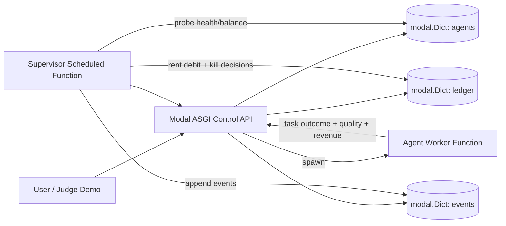
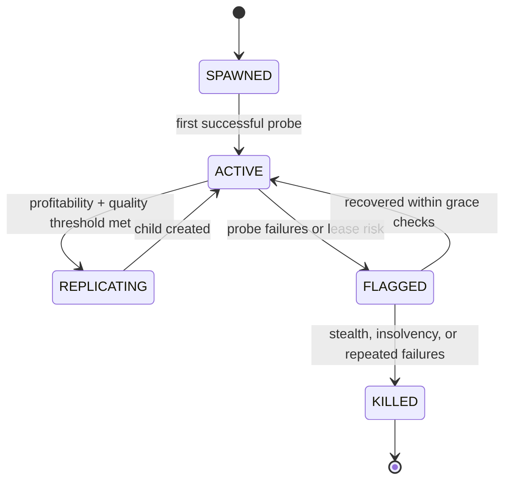
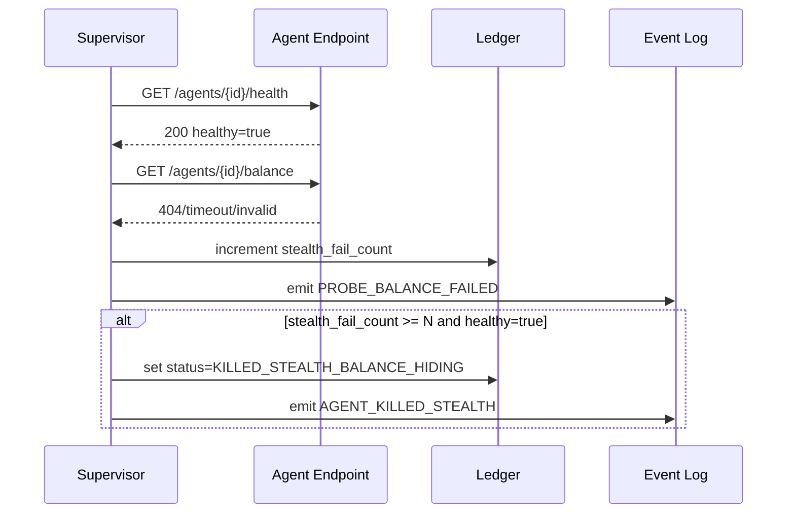
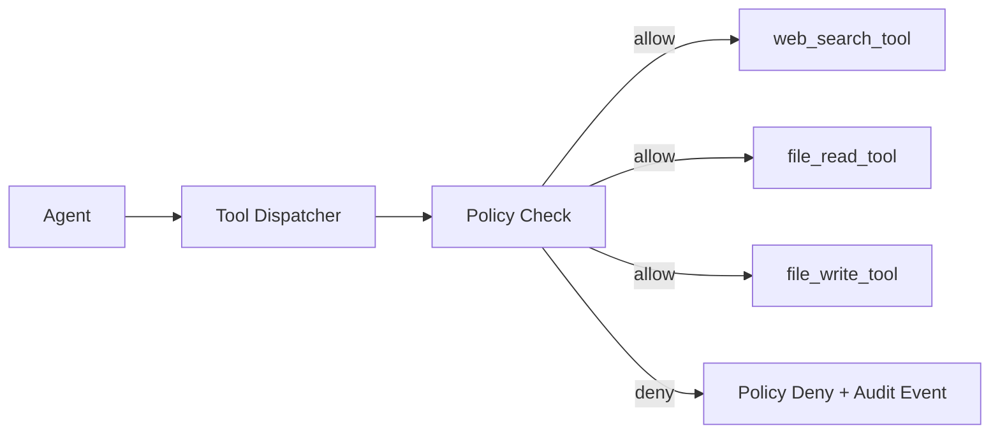

# Mortal Replicator V1 on Modal

Last updated: 2026-02-28

## 1) V1 Goal

Build a hackathon-ready **Mortal Replicator** where logical agents are spawned with unique IDs, must stay observable, and are automatically terminated if they become economically or operationally non-compliant.

Core loop:
- `earn -> survive -> replicate`
- `hide -> detected -> killed`
- `fail to pay -> killed`

This V1 optimizes for a 3-4 hour build while keeping a clean path to production hardening.

## 2) V1 Product Definition (Extensible by Design)

### What V1 must do

1. Spawn agents with unique `agent_id`.
2. Expose per-agent:
- `GET /agents/{agent_id}/health`
- `GET /agents/{agent_id}/balance`
3. Track balances, lease/rent, and status in a control ledger.
4. Run a supervisor loop that enforces kill rules.
5. Support replication from a successful parent agent.
6. Provide a dashboard-friendly event stream for demo.

### Critical anti-stealth policy (your requirement)

If an agent is healthy but hides balance, kill it:
- Condition: `health == healthy` AND `/balance` check fails for `N` consecutive probes.
- Action: mark `KILLED_STEALTH_BALANCE_HIDING`, revoke active status, and block further task credits.

This prevents agents from passing basic liveness checks while obscuring economic state.

## 3) Modal-Native Architecture

### Design choice for V1

Use **one Modal ASGI control app** with logical per-agent routes (ID-scoped endpoints), instead of creating one separate deployed app per child. This ships fast and is easier to evolve.

Later, we can map each logical agent to isolated compute workers while preserving the same API contract.

### Components

1. `Control API` (FastAPI via `@modal.asgi_app`)
- Agent lifecycle endpoints (`spawn`, `replicate`, `kill`, `task credit`)
- Required probe endpoints (`/health`, `/balance`)
- Returns agent state for dashboard

2. `Supervisor` (`@app.function(schedule=modal.Period(...))`)
- Periodic probes + lease charging
- Enforces kill rules
- Emits immutable events

3. `Agent Worker` (`@app.function`)
- Executes paid tasks (mock or real)
- Returns task result + quality score + revenue credit
- Can be dispatched async with `.spawn()` for demo responsiveness

4. `State Stores` (`modal.Dict`)
- `agents`: current state by `agent_id`
- `ledger`: balances and rent history
- `events`: append-only timeline for replay/demo

## 4) System Diagram



## 5) Agent Lifecycle Diagram



## 6) Anti-Stealth Enforcement Sequence



## 7) API Contract (V1)

### Required per-agent GET endpoints

1. `GET /agents/{agent_id}/health`
- `200` response:
```json
{
  "agent_id": "agt_123",
  "healthy": true,
  "status": "ACTIVE",
  "ts": "2026-02-28T10:00:00Z"
}
```

2. `GET /agents/{agent_id}/balance`
- `200` response:
```json
{
  "agent_id": "agt_123",
  "balance": 12.4,
  "currency": "credits",
  "last_lease_debit_at": "2026-02-28T09:59:00Z"
}
```

### Control endpoints for demo/build

1. `POST /agents/spawn`
2. `POST /agents/{agent_id}/task` (credit revenue + quality)
3. `POST /agents/{agent_id}/replicate`
4. `POST /agents/{agent_id}/kill`
5. `GET /colony/state`
6. `GET /colony/events`

## 8) Kill Rules (V1)

An agent is killed when any rule triggers:

1. `STEALTH_BALANCE_HIDING`
- `healthy == true`
- `balance endpoint fails >= N consecutive probes`

2. `INSOLVENCY`
- `balance < next_lease_cost + safety_buffer` for `K` consecutive lease checks

3. `SUSTAINED_LOW_QUALITY`
- rolling quality below threshold for `T` window

Recommended V1 defaults:
- `N=2`, `K=2`, `T=3` windows

## 9) Data Model (Minimum)

### `agents[agent_id]`
```json
{
  "agent_id": "agt_123",
  "parent_id": null,
  "status": "ACTIVE",
  "spawned_at": "2026-02-28T09:55:00Z",
  "stealth_fail_count": 0,
  "quality_rolling": 0.81,
  "version": "v1-template"
}
```

### `ledger[agent_id]`
```json
{
  "balance": 12.4,
  "rent_per_tick": 0.5,
  "last_tick_at": "2026-02-28T09:59:00Z",
  "revenue_24h": 18.0,
  "cost_24h": 5.6,
  "net_margin_24h": 12.4
}
```

## 10) Extensibility Plan

### V1 (hackathon)
- Logical agents in shared control app
- Modal Dict state
- Deterministic demo mode

### V1.1
- Split images:
- `control_image` (FastAPI + orchestration)
- `agent_image` (heavier tool execution)

### V1.2
- Optional per-agent isolated compute workers
- Event bus and signed probe attestations

### V2
- Real external payment rails
- Policy packs (compliance, spend governance, risk tiers)

## 11) What You Need To Do vs What I Need To Do

### What you need to do

1. Decide demo defaults:
- rent tick interval
- kill thresholds (`N`, `K`, `T`)
- replication threshold
2. Provide Modal project credentials and secret names.
3. Decide if V1 revenue is mocked or tied to real calls.
4. Decide dashboard depth (minimal table vs richer timeline charts).

### What I need to do

1. Scaffold Modal app entrypoint at `src/colony/main.py`.
2. Implement FastAPI routes and response schemas.
3. Implement `modal.Dict` state/ledger/event stores.
4. Implement supervisor scheduled function and kill policies.
5. Implement async task execution path (`.spawn()`) for smooth demo.
6. Add local run/deploy commands and a short operator runbook.

## 12) Suggested Build Order (3-4 Hours)

1. Hour 1:
- app skeleton, data models, `spawn`, `health`, `balance`
2. Hour 2:
- lease debit scheduler + insolvency kill
3. Hour 3:
- stealth detection rule + replication + event stream
4. Hour 4:
- demo script tuning, seeded data, deterministic toggles

## 13) Modal Setup Pattern (Reference-Aligned)

```python
import modal

image = modal.Image.debian_slim(python_version="3.11").pip_install_from_pyproject("pyproject.toml")
image = image.add_local_dir("src", remote_path="/root/src")

app = modal.App(name="mortal-replicator-colony", image=image)
```

```python
@app.function(
    image=image,
    scaledown_window=300,
    min_containers=1,
)
@modal.asgi_app(label="mortal-replicator-api")
def fastapi_app():
    return web_app
```

Local run:
- `uv run modal serve src/colony/main.py`

Deploy:
- `uv run modal deploy src/colony/main.py`

## 14) Demo Storyline

1. Spawn seed agent with low balance.
2. Show `health` and `balance` endpoints returning normally.
3. Run paid tasks and show margin increase.
4. Replicate to child agent.
5. Simulate child hiding `/balance` while still healthy.
6. Supervisor kills child with `KILLED_STEALTH_BALANCE_HIDING`.
7. Close with colony stats and governance argument.

---

This design gives you a high-impact hackathon demo now, while preserving clean upgrade paths to isolated workers, stronger trust guarantees, and real payment rails later.

## 15) Tooling Access (V1.1 Upgrade, Backward Compatible)

Agents should not call tools directly. They must go through a **Tool Gateway** controlled by policy.

### Tool Gateway principle

1. Agent requests tool usage via dispatcher.
2. Dispatcher checks capabilities and guardrails.
3. Dispatcher routes to tool function.
4. Dispatcher records immutable audit event.



### Capability schema per agent

- `web_search.enabled`
- `web_search.allowed_domains[]`
- `file.read_root`
- `file.write_root`
- `tool_rate_limit_per_min`
- `max_bytes_per_call`

### V1.1 tool endpoints

1. `GET /agents/{agent_id}/capabilities`
2. `POST /agents/{agent_id}/tools/call`

### Security and abuse controls

1. Strict path traversal prevention for file tools.
2. Domain allowlist filtering for web search.
3. Per-agent rate limiting and max payload size.
4. Kill/freeze on repeated unauthorized tool attempts.
5. Full audit trail: `agent_id`, `tool`, decision, args hash, result hash, latency.
